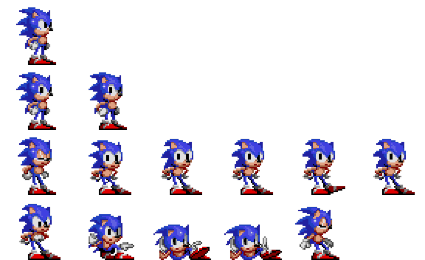

<div align="center">

# ⚡ Mark XX

### Portfólio moderno, performático e interativo com React + TypeScript

<p>
  
  
  
  
  
</p>


</div>

---

## ✨ Sobre o projeto

O **Mark XX** é uma aplicação web com foco em experiência visual e performance, construída como uma vitrine digital de projetos, trajetória, tecnologias e conteúdos dinâmicos.

Principais destaques:

- 🎨 Interface moderna com animações e transições suaves.
- ⚡ Pré-carregamento inteligente de dados para navegação rápida.
- 🧠 Cache persistente com React Query + persisters.
- 🧩 Arquitetura modular por domínios (controllers, fetchers, mappers, stores).
- 🕹️ Easter eggs e componentes interativos para uma experiência única.

---

## 🛠️ Stack principal

- **Frontend:** React 19, React Router, Motion
- **Linguagem:** TypeScript
- **Build Tool:** Vite
- **Estilização:** Tailwind CSS
- **Estado global:** Zustand + Immer
- **Data fetching/cache:** TanStack React Query
- **CMS/API:** Prismic + GitHub API
- **Qualidade:** ESLint, Vitest, Husky, Commitlint

---

## 📸 Imagens e prints

> Como o projeto é altamente animado, abaixo estão imagens/artefatos visuais já incluídos no repositório.

### Hero / visual loading


### Elementos gráficos



### Sprite (efeitos visuais)


---

## 🚀 Como rodar localmente

### Pré-requisitos

- Node.js 20+
- pnpm 9+

### 1) Instalar dependências

```bash
pnpm install
```

### 2) Configurar variáveis de ambiente

Crie os arquivos `.env` e `.env.test` com as variáveis esperadas em `src/env.ts`.

### 3) Ambiente de desenvolvimento

```bash
pnpm dev
```

### 4) Build de produção

```bash
pnpm build
pnpm preview
```

---

## ✅ Scripts úteis

```bash
pnpm dev              # inicia ambiente de desenvolvimento
pnpm build            # gera build de produção
pnpm preview          # executa build localmente
pnpm test             # roda testes com cobertura
pnpm test:unit        # roda apenas testes unitários
pnpm type-check       # valida tipagem TypeScript
pnpm lint:check       # checa lint
pnpm lint:fix         # corrige lint automaticamente
pnpm prismic:generate-types  # gera tipos do Prismic
```

---

## 🧱 Estrutura de pastas (resumo)

```text
src/
├─ app/            # páginas, componentes, layouts e providers
├─ config/         # configurações de UI, requests, partículas, easter-eggs
├─ services/       # controllers, fetchers, mappers, stores, APIs e builders
├─ @types/         # contratos e tipagens por domínio
└─ env.ts          # schema e validação de variáveis de ambiente
```

---

## 🤝 Contribuição

Este projeto é privado, mas você pode contribuir internamente com:

1. Branch feature/correção
2. Commits semânticos
3. Pull request com descrição clara e evidências (logs/prints)

---

## 📄 Licença

Uso **privado**.

---

<div align="center">

Feito com ❤️, TypeScript e boas animações.

</div>
