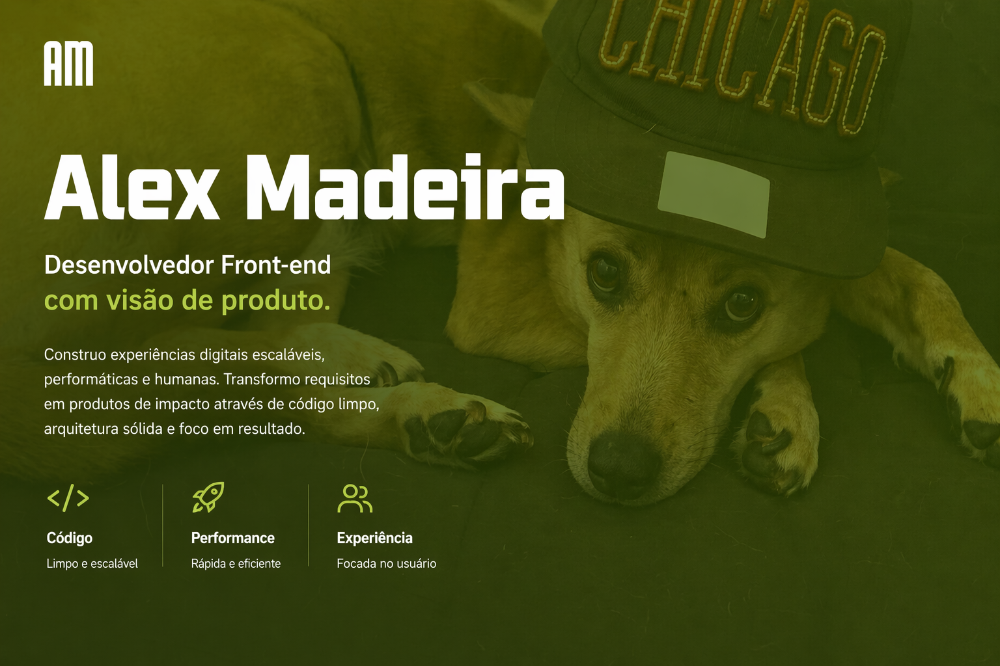
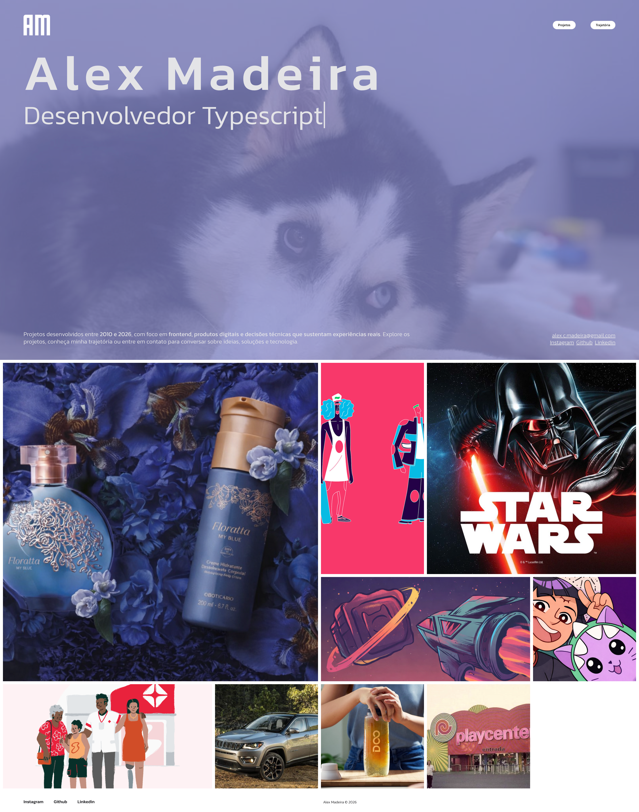

<p align="center">
  
  
</p>

<h1 align="center">MARK-XX</h1>

<p align="center">
  Portfólio pessoal focado em performance, arquitetura e experiência.
</p>

<p align="center">
  <a href="https://alexmadeira.com.br"></a>
  <a href="https://github.com/alexmadeira/mark-xx"></a>
  
  
  
</p>

<p align="center">
  
  
  
  
  
  
</p>

---

<p align="center">
  
</p>

---

## Sobre

O **MARK-XX** é um portfólio que funciona como laboratório técnico.

A proposta não é apenas expor interface. O projeto foi estruturado para demonstrar:
- arquitetura modular
- performance percebida
- persistência e resiliência de navegação
- sistema visual orientado por tokens
- experimentação controlada com features isoladas

---

## Preview

<p align="center">
  
</p>

---

## Stack

```txt
React 19
Vite 7
TypeScript 5.9
TailwindCSS v4
Zustand
TanStack React Query + Persist
Prismic CMS
Mitt
Phaser
Vite PWA
```

---

## Por que esse projeto é diferente

### 1. Sistema visual orientado por tokens

O projeto utiliza um sistema centralizado de design tokens de `font`, `colors`, `spacing`, `animation` e `breakpoint`, centralizados no `global.css`. A paleta inclui famílias próprias como `mark`, `nextjs`, `web` e `html`, reforçando a ideia de identidade visual por tecnologia.

### 2. Arquitetura em camadas

A estrutura separa UI, serviços, fetchers, builders, mappers, stores e tipagem dedicada. Isso reduz acoplamento, melhora previsibilidade e facilita evolução em escala. A árvore do projeto mostra essa separação com clareza. 

### 3. PWA e cache de runtime

O projeto usa `VitePWA` com estratégias de cache para fontes, GitHub API, Cloudinary e Prismic CDN, reforçando a abordagem offline-first e a redução de round trips. 

### 4. Engenharia orientada a experiência

Mesmo elementos “extras” servem como prova técnica. O projeto possui easter eggs e integração com Phaser, o que transforma features paralelas em um campo de teste para lazy loading, isolamento e eventos globais. A presença do game e do módulo snake aparece diretamente na base do repositório. 

### 5. Identidade própria

O repositório possui um logo SVG próprio em componente React, o que permitiu derivar os assets deste README mantendo coerência visual com a base do projeto. 

---

## Fluxo técnico

```txt
API → Requester → Fetcher → Mapper → Store → UI
```

Essa organização favorece:
- contratos mais previsíveis
- tipagem forte ponta a ponta
- reaproveitamento de integrações
- menor vazamento de responsabilidade na UI

---

## Recursos principais

- **Design tokens centralizados**
- **PWA com cache inteligente**
- **React Query com persistência**
- **Stores por domínio com Zustand**
- **Prismic como fonte de conteúdo**
- **Feature experimental com Phaser**
- **Event-driven communication com `mitt`**
- **Separação clara entre dados, estado e renderização**

---

## Estrutura

```txt
src/
├── app/             # páginas, componentes e providers de UI
├── services/        # regras, builders, controllers, mappers e stores
├── config/          # configuração de requester, UI e partículas
├── game/            # engine e módulos do easter egg Snake
├── @types/          # contratos e tipagens globais
└── styles/          # tokens e CSS global
```

---

## Rodando localmente

```bash
pnpm install
pnpm dev
```

### Outros comandos

```bash
pnpm build
pnpm test
pnpm test:unit
pnpm lint:check
pnpm lint:fix
pnpm type-check
```

Os scripts de build, testes, lint e geração de tipos estão definidos no `package.json`. 

---

## Filosofia

- UI bonita sem consistência técnica não sustenta produto.
- Performance percebida vale mais do que “efeito demo”.
- Arquitetura invisível é parte do valor.
- Portfólio também pode ser ambiente de engenharia.

---

## Assets incluídos neste kit

```txt
docs/assets/
├── hero-readme.svg
├── logo-gradient.svg
└── preview-placeholder.svg
```

---

## Autor

**Alex Madeira**  
Front-end Engineer focado em performance, arquitetura e experiência.

<p>
  <a href="https://www.linkedin.com/in/alex-madeira/">LinkedIn</a> ·
  <a href="https://alexmadeira.com.br">Website</a>
</p>
